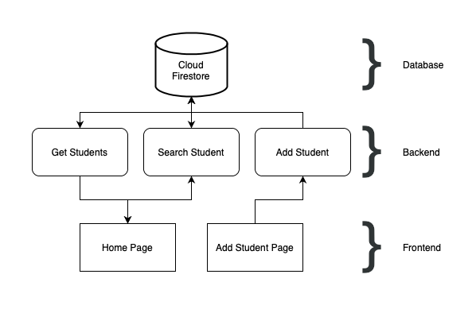
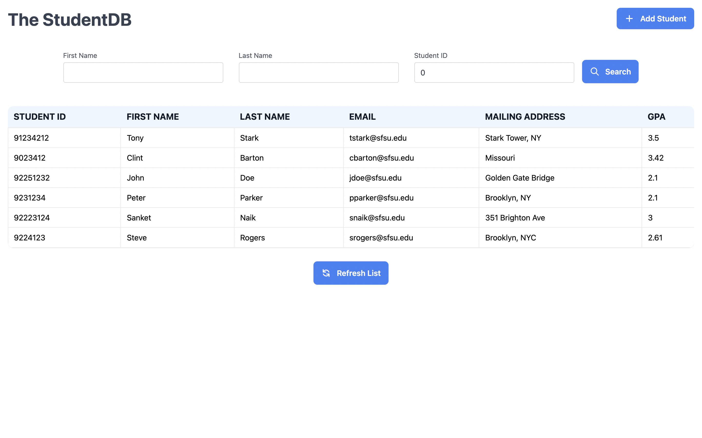
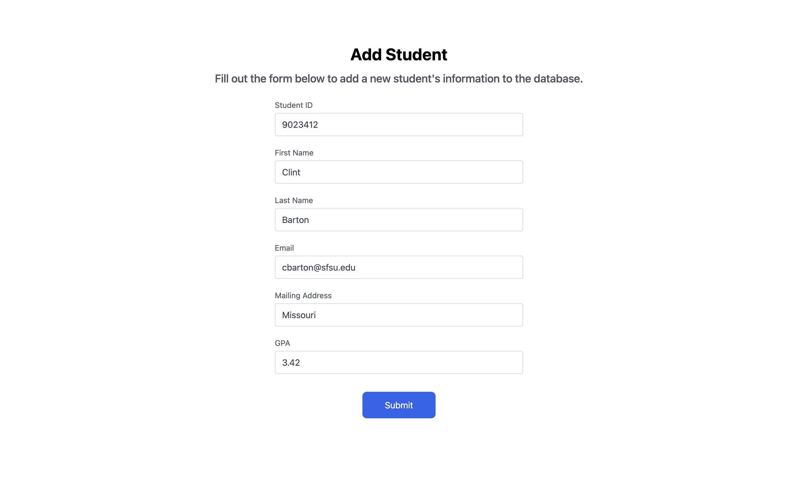
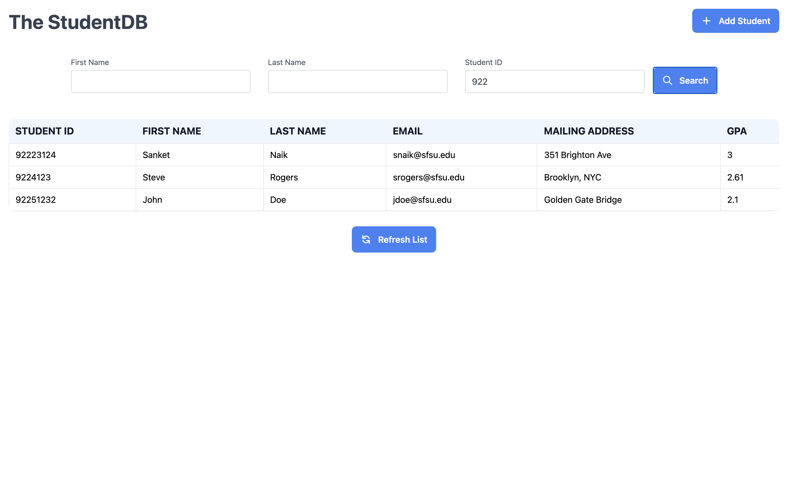
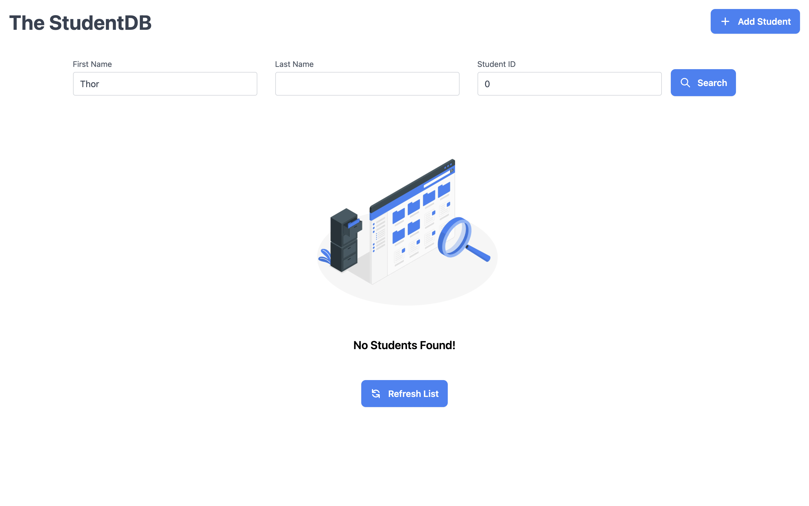

# CSC 847: Project 1

## Project Introduction

This project has been built using Next.js and Google's Cloud Firestore. Next.js is a react framework that includes extra features such as server-side rendering. Cloud Firestore is a document-based NoSQL database where the data is stored in the form of collections and documents.

### **Frontend**

The frontend of the project was built using Next.js and TailwindCSS. It consists of two pages as follows -

#### Home Page

The home page of the application displays a table that shows the information of all the students in the database. This page also contains the search form that can be used to search for any specific student's information. The home page has a button called 'Add Student' which redirects the user to the **Add Student page**.

#### Add Student Page

The add student page consists of a form that can be used to add a new student to the database. Form validation has been added to the add student form which prompts the user in case of a bad or invalid input such as an improper email or a missing field.

### **Backend**

The backend consists of 3 API endpoints which are called from the frontend. The backend is also responsible for adding and reading data from the database. The 3 API endpoints are as follows -

#### Get Students

This endpoint is called when the homepage loads. It fetches all the entries from the database and returns them to the frontend as an array of `Student` objects.

#### Add Student

The add student endpoint gets called when a user submits the add student form. It receives the student's information from the frontend and adds it to the database.

#### Search Student

The search student endpoint is called when a user submits the search form on the homepage. This endpoint searches the database and returns the information of students that match the 3 parameters - first name, last name and student ID.

## GCP Experience

I have typically deployed Next.js projects on platforms such as Firebase, Netlify and Vercel. These platforms have been built to host static sites and do not host the backend or the database.

GCP provides an all-inclusive solution for hosting full-stack applications by providing the database (Cloud Firestore for this project) and the compute engine in one place.

Deploying the application on Google Compute Engine was fairly simple and updating the application after a new change has been made takes very little time.

## Problems Faced while Building the Project

One of the key challenges for this project was building the **Search Student** endpoint. Since Cloud Firestore does not support full-text search, a workaround had to be implemented. I was able to solve the problem by utilizing Cloud Firestore's query mechanism followed by some filtering in the backend. Doing this allowed me to implement the partial search feature (searching by typing a part of a student's name) and the multiple field search feature (searching by first name, last name and sid at the same time).

## Additional Screenshots

1. Search - When results are found
   

2. Search - When no results are found
   
